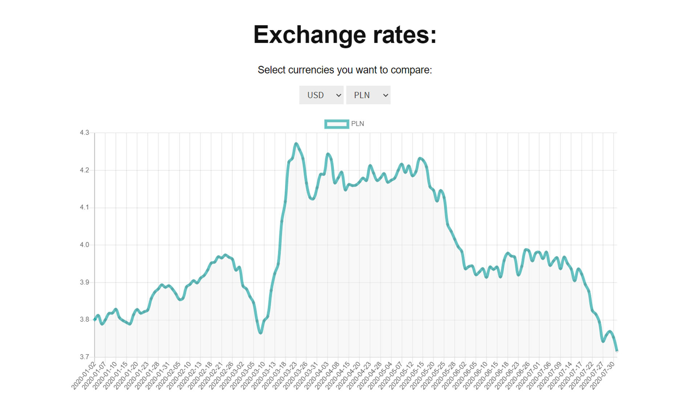

# JavaScript-exercise-10-Exchange-rates-with-AJAX
Application made during 6-hours workshop, with emphasis on using external API, practicing asynchronous JavaScript and using JS library - charts.js.

## General information

Exercise consisted of following tasks:

1. Acquire exchange rates data from https://exchangeratesapi.io/
2. Fill the select elements with available currencies
3. Generate line chart using charts.js and data extracted in step 1
4. Charts schould change dynamically while user selects any currency

## Used Technologies
* JavaScript
* HTML5/CSS
* charts.js 

## Project status
Project is finished